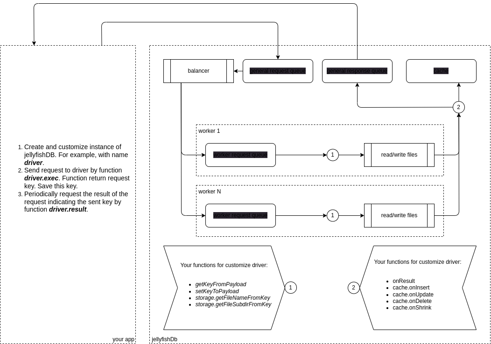

<div id="badges">
  <a href="https://www.linkedin.com/in/vasilev-vitalii/">
    
  </a>
  <a href="https://www.youtube.com/@user-gj9vk5ln5c/featured">
    
  </a>
</div>

# JellyfishDB
Embedded NoSQL "database", based on file storage.

## License
*MIT*
## Install
```
npm i jellyfishdb
```
## Work schema



## Example
```typescript
//WARNING!!!
//if you use path library in jellyfishDB function (see function getFileSubdirFromKey in driver2)
//don't use:
//import * as path from 'path'
//use:
//import path from 'path'
import path from 'path'
import * as fs from 'fs-extra'
import {CreateDriver, EnumQuery, TExecResult} from 'jellyfishdb'

//in examples use property "key" in Person as primary key
export type TPerson = {key: string, login: string, email: string, country: string }
export type TPersonCache = {key: string, login: string, ddm: string }

const driver1StorageGir = path.join(__dirname, '../../test/data/driver1')
const driver2StorageGir = path.join(__dirname, '../../test/data/driver2')

fs.emptyDirSync(driver1StorageGir)
fs.emptyDirSync(driver2StorageGir)

const personList: TPerson[] = [
    { key: null, login: 'peter', email: 'peter@gmail.com', country: null },
    { key: null, login: 'anna', email: 'anna@gmail.com', country: 'France' },
    { key: null, login: 'helen', email: null, country: 'Spain' }
]

//minimal
const driver1 = CreateDriver<TPerson,TPersonCache>({
    getKeyFromPayload(payLoad) {
        return payLoad.key
    },
    setKeyToPayload(payLoad, keyDefault) {
        payLoad.key = keyDefault
        return payLoad.key
    }
})

//maximal
const driver2 = CreateDriver<TPerson,TPersonCache>({
    getKeyFromPayload(payLoad) {
        return payLoad.key
    },
    setKeyToPayload(payLoad, keyDefault) {
        payLoad.key = `psn-${keyDefault}`
        return payLoad.key
    },
    cache: {
        onDelete(stamp, cache) {
            const fnd = cache.find(f => f.key === stamp.payLoadStamp.data.key)
            if (fnd) {
                fnd.ddm = stamp.wrapStamp.wrap.ddm
            }
        },
        onShrink: (cache) => {
            let fndIdx = cache.findIndex(f => f.ddm)
            while (fndIdx >= 0) {
                cache.splice(fndIdx, 1)
                fndIdx = cache.findIndex(f => f.ddm)
            }
        },
        onInsert: (stamp, cache) => {
            cache.push({ login: stamp.payLoadStamp.data.login, key: stamp.payLoadStamp.data.key, ddm: stamp.wrapStamp.wrap.ddm })
        },
        onUpdate: (stamp, cache) => {
            const fnd = cache.find(f => f.key === stamp.payLoadStamp.data.key)
            if (fnd) {
                fnd.login = stamp.payLoadStamp.data.login
                fnd.ddm = stamp.wrapStamp.wrap.ddm
            } else {
                cache.push({ login: stamp.payLoadStamp.data.login, key: stamp.payLoadStamp.data.key, ddm: stamp.wrapStamp.wrap.ddm })
            }
        },
    },
    storage: {
        getFileNameFromKey(key, fileNameDefault) {
            return `prefix-${fileNameDefault}`
        },
        getFileSubdirFromKey(key) {
            const pathPart = key.substring(4, 7)
            return path.join(...pathPart)
        }
    }
})

driver1.connect({dir: driver1StorageGir, countWorker: 8}, error => {
    console.error(error)
})
driver2.connect({dir: driver2StorageGir, countWorker: 8}, error => {
    console.error(error)
})

const queueResult = [] as {driverIdx: number, personIdx: number, taskKey: string, result?: TExecResult<TPerson>}[]

//example - insert data
personList.forEach((person, personIdx) => {
    const taskKey1 = driver1.exec({kind: EnumQuery.insert, payLoad: person})
    const taskKey2 = driver2.exec({kind: EnumQuery.insert, payLoad: person})
    queueResult.push({driverIdx: 1, personIdx, taskKey: taskKey1})
    queueResult.push({driverIdx: 2, personIdx, taskKey: taskKey2})
})

const timer = setInterval(() => {
    queueResult.filter(f => !f.result).forEach(q => {
        const result = q.driverIdx === 1 ? driver1.result(q.taskKey) : q.driverIdx === 2 ? driver2.result(q.taskKey) : undefined
        if (result) {
            console.log(`driver${q.driverIdx}-result:`, result)
            q.result = result
        }
    })
    if (queueResult.some(f => !f.result)) {
        return
    }
    console.log('driver2-cache:', driver2.cache)
    console.log('app can be stopped...')
    clearInterval(timer)
}, 1000)

```

